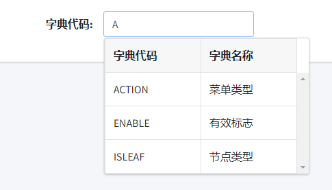

# bootstrap4风格的下拉表格选择插件(需要jquery)
#### html
```
  <input type="text" class="form-control" id="dictName" name="dictName"
               placeholder="字典名">
```
#### js
```
  <script>
  let option = {
    "url": "/system/dict/sys-dict/listSelect",
    "idField": "dictCode",
    "textField": "dictCode",
    "queryField": "paramStr",
    "minLength": 1,
    "panelWidth": "300"
  }
  $("#dictCode").selectGrid(option);
  </script>
```

#### 效果图

